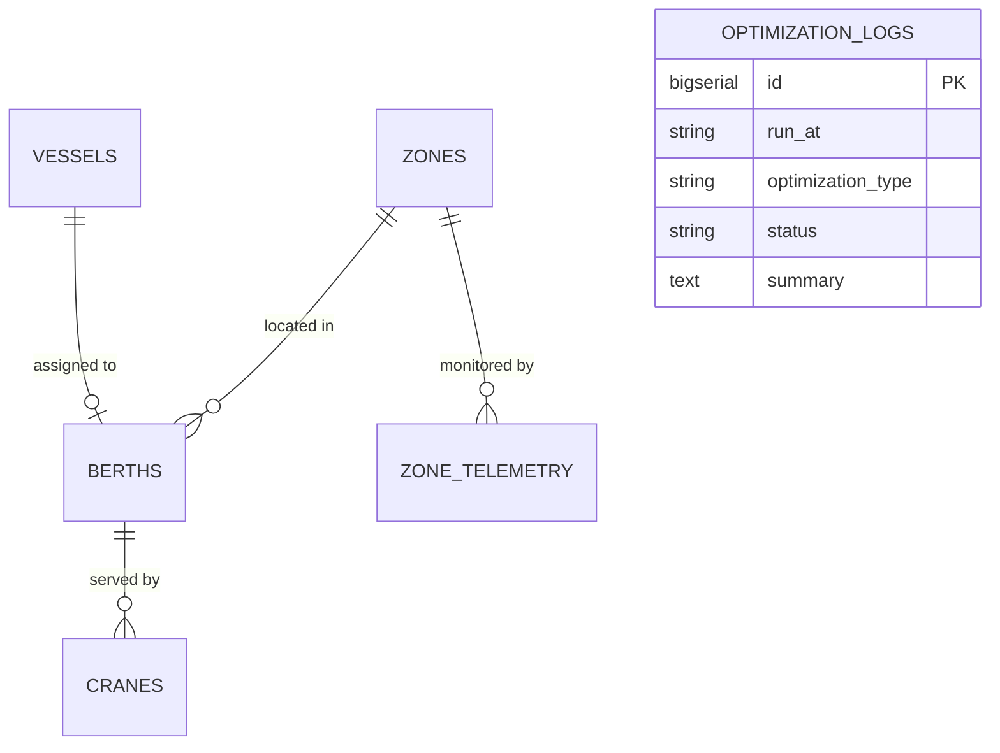

# 🏗️ Architecture — PortFlow AI Digital Twin Platform

## 1. System Architecture Overview

PortFlow AI is engineered as an asynchronous, modular microservices-compatible digital twin platform. The system coordinates five core tiers: an interactive React 18 single-page operations application, a high-throughput FastAPI REST backend, a Scikit-learn Random Forest ML pipeline, a deterministic discrete optimization suite, and a hybrid data layer combining Supabase Cloud PostgreSQL with local SQLite persistence.

```mermaid
flowchart TB
    subgraph ClientLayer ["Client Layer (Port Operations Center)"]
        UI["React 18 + Vite Operations Dashboard"]
        COPILOT_UI["AI Copilot Interactive Drawer"]
        TWIN["HTML5 Canvas Digital Twin Port Map"]
        WORLD_MAP["World Map Maritime AIS & Weather Operations"]
        ROUTE_MODAL["Interactive Route Acceptance Modal (Why Accept / Decline)"]
        GANTT["72h Horizon Gantt & Schedule View"]
    end

    subgraph APILayer ["FastAPI Orchestration Backend (:8000)"]
        MAIN["main.py (CORS, Lifespan, /health)"]
        R_MARITIME["/api/vessels (AIS Telemetry, Weather, Reroute, Decisions)"]
        R_PRED["/api/predictions (Congestion & Hotspots)"]
        R_OPT["/api/optimisation (Berths, Cranes, Routes)"]
        R_PLAN["/api/planning (72-Hour Horizon Matrix)"]
        R_COP["/api/copilot (Grounded Multi-LLM Chat)"]
        R_SUPA["/api/supabase (Status, Sync, Cloud CRUD)"]
    end

    subgraph MaritimeAIEngine ["Maritime AI & Weather Intelligence"]
        AIS_SRV["ais_service.py (Live AIS Telemetry & Seaward Clamping)"]
        WX_SRV["weather_service.py (Open-Meteo Marine Weather API)"]
        REROUTE_SRV["rerouting_service.py (100% Oceanic Safe Fairways)"]
        RECOM_SRV["recommendation_service.py (Explainable Acceptance Trade-offs)"]
        COST_SRV["cost_service.py (Multi-Currency Demurrage Valuation)"]
    end

    subgraph MLLayer ["Machine Learning Pipeline"]
        RF_MODEL["RandomForestRegressor (congestion_model.pkl)"]
        ETA_GB["GradientBoostingRegressor (eta_model.pkl)"]
        RISK_RF["RandomForestClassifier (risk_model.pkl)"]
        FEAT_PIPE["PortFeaturePipeline (StandardScaler + Encoders)"]
        SYN_DATA["data_generator.py (2,400 Historical Records)"]
    end

    subgraph OptimisationLayer ["Deterministic Operational Solvers"]
        BERTH_SOLVER["Priority-Queue Berth Allocator (UKC + LOA Check)"]
        CRANE_SOLVER["Earliest Deadline First (EDF) Crane Scheduler"]
        ROUTE_SOLVER["Dijkstra Channel Routing (14 Waypoint Graph)"]
        PLAN_72H["Multi-Horizon 72h Planner (12 Slices)"]
    end

    subgraph ExternalAPIs ["Live External Feeds & Foundation Models"]
        OPEN_METEO["Open-Meteo Marine API (Waves, Winds, Currents)"]
        EXCHANGE_API["ExchangeRate-API (Multi-Currency Demurrage)"]
        WATSONX["IBM watsonx.ai (Granite-3-8B Instruct)"]
        GROQ_LLM["Groq Cloud (Llama 3.3 70B Versatile)"]
        GEMINI_LLM["Google Gemini 1.5/2.0 Flash"]
        DETERMINISTIC_AI["PortFlow Grounded Engine (Offline)"]
    end

    subgraph DataStorage ["Data & Telemetry Layer"]
        SUPABASE[(Supabase Cloud PostgreSQL)]
        SQLITE_DB[(SQLite Local Fallback: portflow.db)]
        CONTRACT["data_contract.md (Canonical Data Ground Truth)"]
    end

    UI <--> MAIN
    COPILOT_UI <--> R_COP
    WORLD_MAP <--> R_MARITIME
    ROUTE_MODAL <--> R_MARITIME
    MAIN --> R_MARITIME
    MAIN --> R_PRED
    MAIN --> R_OPT
    MAIN --> R_PLAN
    MAIN --> R_COP
    MAIN --> R_SUPA

    R_MARITIME --> AIS_SRV
    R_MARITIME --> WX_SRV
    R_MARITIME --> REROUTE_SRV
    R_MARITIME --> RECOM_SRV
    R_MARITIME --> COST_SRV

    WX_SRV <--> OPEN_METEO
    COST_SRV <--> EXCHANGE_API
    REROUTE_SRV --> RISK_RF
    REROUTE_SRV --> ETA_GB

    R_PRED --> RF_MODEL
    RF_MODEL <--> FEAT_PIPE
    
    R_OPT --> BERTH_SOLVER
    R_OPT --> CRANE_SOLVER
    R_OPT --> ROUTE_SOLVER
    R_PLAN --> PLAN_72H
    PLAN_72H --> RF_MODEL

    R_COP --> GROQ_LLM
    R_COP --> GEMINI_LLM
    R_COP --> WATSONX
    R_COP --> DETERMINISTIC_AI

    R_SUPA <--> SUPABASE
    BERTH_SOLVER <--> SQLITE_DB
    CRANE_SOLVER <--> SQLITE_DB
    ROUTE_SOLVER <--> SQLITE_DB
```

---

## 2. Component Specifications

| Component | Technology | Primary Responsibility |
|---|---|---|
| **Digital Twin Web UI** | React 18, Vite, Vanilla CSS, Tailwind, Framer Motion, Recharts | Real-time situational port map, Gantt berth allocation timeline, multi-zone congestion heatmaps, role-based dispatcher switching, and AI Copilot slide-over drawer. |
| **Maritime World Map UI** | React 18, Mapbox GL / Leaflet, Framer Motion | High-definition oceanic navigation canvas displaying live AIS vessel transponders, real-time severe storm polygons, dynamic green oceanic bypass corridors, and interactive route acceptance modals with full why accept/decline trade-offs. |
| **Orchestration API** | Python 3.11+, FastAPI, Uvicorn, Pydantic v2 | High-concurrency asynchronous REST endpoints serving predictions, discrete optimizations, 72-hour planning, Copilot chats, and maritime telemetry. |
| **Maritime AI Subsystem** | Python, NumPy, Haversine, Open-Meteo Client | Live AIS telemetry generation, real-time marine weather ingestion, 100% oceanic deepwater fairway computation (zero land traversal), and operator route decision persistence. |
| **Voyage ML Regressors & Classifiers** | Scikit-learn, Gradient Boosting, Random Forest | Multi-factor models predicting voyage ETA delta under storm resistance and classifying route safety hazard levels ($0-100\%$). |
| **Multi-Currency Demurrage Engine** | Python, ExchangeRate-API, BIMCO formulas | Calculates financial demurrage exposure and fuel expenditure in 8 global currencies (USD, EUR, GBP, JPY, SGD, INR, CNY, AED) with live rates. |
| **Congestion Predictor (ML)** | Scikit-learn, NumPy, Pandas, Joblib | Random Forest regressor with 100 decision trees predicting multi-zone congestion indices ($R^2 > 0.96$, RMSE $< 3.2$) across zones A–F in 6-hour intervals. |
| **Berth Allocation Solver** | Python (`heapq`, priority queues) | Matches incoming container vessels to 12 berths while strictly checking draft + 1.0m UKC safety clearance, LOA limits, and cargo compatibility. |
| **Crane Dispatch Solver** | Python (Earliest Deadline First) | Allocates 7 STS container gantry cranes to maximize moves per hour and eliminate demurrage risks on approaching departure windows. |
| **Channel Routing Solver** | Python (Dijkstra shortest path) | Navigates 14 waypoints, computing dynamic fairway depths against semi-diurnal tidal heights to avoid navigational grounding. |
| **72-Hour Horizon Engine** | Python (Multi-slice matrix) | Simulates operational states across 12 six-hour slices, calculating cumulative turnarounds and identifying impending terminal gridlocks. |
| **Enterprise Cloud DB** | Supabase (PostgreSQL 15), PostgREST | Cloud database holding canonical records for 15 vessels, 12 berths, 7 cranes, and time-series telemetry with Row-Level Security (RLS). |
| **Local Persistence Fallback** | SQLite, SQLAlchemy 2.0 ORM | Embedded zero-configuration local database (`portflow.db`) ensuring full offline functionality and sub-millisecond query latency. |
| **AI Copilot Service** | Multi-Provider (IBM watsonx, Groq, Gemini, Deterministic) | Real-time dispatch advisor that dynamically injects live database facts into the system prompt, enforcing zero hallucinations. |

---

## 3. Data Flow & Execution Lifecycle

1. **Telemetry Ingestion & State Refresh:**
   The backend loads or refreshes canonical port state from Supabase PostgreSQL (or local SQLite). State includes 15 vessels, 12 berths, 7 cranes, gate queues, and weather telemetry.
2. **Feature Pipeline Transformation:**
   Continuous sensor telemetry (wind knots, visibility NM, tide height m, yard occupancy %, crane utilization %) is transformed via `PortFeaturePipeline` using StandardScaler normalization.
3. **Multi-Horizon ML Congestion Forecasting:**
   The Random Forest model evaluates the 6 port zones (A through F), generating congestion scores ($0.0 - 100.0$) and isolating dominant bottleneck drivers (e.g. low tide windows or yard saturation).
4. **Physical Optimization Execution:**
   - **Berth Allocator:** Evaluates vessel priorities, LOA constraints, and under-keel clearance ($Draft + 1.0m \le Berth Max Draft$), assigning optimal berths and queuing unassigned vessels.
   - **Crane Allocator:** Distributes 7 STS cranes to berthed vessels using Earliest Deadline First (EDF) scheduling.
   - **Fairway Router:** Evaluates the 14-waypoint channel graph, routing ships through safe basinal fairways based on tidal clearance.
5. **Maritime AI Telemetry, Oceanic Routing & Operator Acceptance:**
   - **Live AIS Telemetry Ingestion:** Streams real-time vessel position, SOG, COG, and UKC with seaward clamping ensuring vessels remain exclusively in deep navigable waters.
   - **Marine Weather Sampling:** Ingests live wave heights, swell periods, wind speeds, and ocean surface currents from Open-Meteo Marine API.
   - **Storm Bypass & 100% Oceanic Fairways:** When high wave heights or cyclone hazards intercept a voyage, `rerouting_service.py` synthesizes safe deepwater waypoints around the storm with zero land or shallow coastal traversal.
   - **Explainable Trade-off Generation:** `recommendation_service.py` evaluates risk reductions, ETA delays, bunker consumption, and demurrage to generate an explicit "Why Accept" vs "Why Decline" dossier.
   - **Operator Authorization & Persistence:** The dispatcher reviews the side-by-side trade-off modal on the World Map UI. Upon clicking "Accept Route", `POST /api/vessels/{mmsi}/route-decision` persists the decision, and the frontend instantly hides the hazardous red route, displaying solely the active green oceanic bypass corridor.
6. **Grounded AI Copilot Interaction:**
   When an operator asks a question (e.g. *"Which berths are currently empty?"* or *"What is causing congestion in Zone B?"*):
   - The query passes through the domain guardrail filter.
   - Live numerical state is assembled into a structured context snapshot.
   - The query and facts are forwarded to the configured LLM (Groq / watsonx / Gemini) with strict anti-hallucination rules, or processed by the internal deterministic engine.
   - A verified, factual response citing exact berth IDs, vessel names, and metrics is returned in under 2 seconds.

---

## 4. Database Schema & Supabase Architecture

The database architecture is defined in [`src/backend/db/supabase_schema.sql`](../src/backend/db/supabase_schema.sql):

- **`vessels`**: `vessel_id` (PK), `name`, `imo`, `flag`, `type`, `length_m`, `beam_m`, `draft_m`, `teu`, `dwt`, `status`, `eta_utc`, `etd_utc`, `assigned_berth_id`, `speed_knots`, `priority`.
- **`berths`**: `berth_id` (PK), `zone_id`, `terminal`, `max_length_m`, `max_draft_m`, `cargo_types` (JSONB), `is_occupied`, `current_vessel_id`.
- **`cranes`**: `crane_id` (PK), `name`, `zone_id`, `compatible_berths` (JSONB), `moves_per_hour`, `status`, `assigned_vessel_id`.
- **`zone_telemetry`**: `id` (PK), `zone_id`, `timestamp_utc`, `vessel_count`, `avg_draft_m`, `wind_knots`, `visibility_nm`, `tide_m`, `crane_util`, `yard_occ`, `congestion_index`, `risk_level`.
- **`optimization_logs`**: `id` (PK), `run_at`, `optimization_type`, `status`, `summary`.

---

## 5. Security & Reliability Engineering

- **Row Level Security (RLS):** Supabase tables enforce granular access control policies allowing public anon reads while safeguarding schema integrity.
- **Environment Isolation:** Secrets (`GROQ_API_KEY`, `WATSONX_APIKEY`, `SUPABASE_KEY`) are managed strictly through `.env` files and omitted from version control via `.gitignore`.
- **Zero-Crash Resilience:** If cloud services, external LLM APIs, or network connections become unavailable, the system automatically falls back to local SQLite and the deterministic grounded engine without throwing 500 errors.
- **SQL Injection Prevention:** All queries use SQLAlchemy ORM parameterized statements and PostgREST sanitization.
- **CORS Protection:** Configured in FastAPI to regulate origin access between the React dashboard and backend services.

---

## 6. Scalability & Edge Deployment

- **Sub-2ms Inference:** Random Forest model inference executes in under 2 milliseconds, capable of handling high-frequency real-time AIS transponder streams.
- **Stateless Backend:** The FastAPI application is fully stateless, allowing seamless container auto-scaling on Kubernetes, Docker Swarm, or IBM Cloud Code Engine.
- **Edge Deployment Ready:** The lightweight architecture requires under 512MB of RAM, making it fully deployable on local edge servers at harbor tower stations, vessel traffic services (VTS), or offshore pilot cutters.
