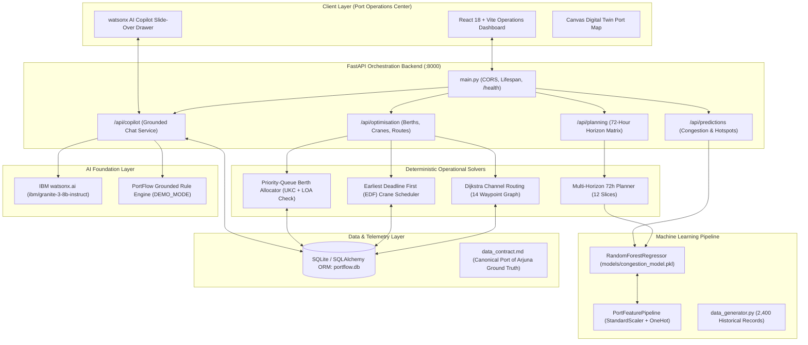

# Architecture — PortFlow AI Digital Twin Platform

## System Architecture

PortFlow AI is engineered as a multi-tier microservices-compatible architecture featuring an interactive React 18 single-page operations application, an asynchronous FastAPI orchestration backend, an offline/online Scikit-learn Random Forest ML pipeline, a deterministic discrete optimization suite, and an IBM watsonx.ai Copilot integration.

## Components

| Component | Technology | Responsibility |
|---|---|---|
| **Digital Twin Web UI** | React 18, Vite, Vanilla CSS, Tailwind, Framer Motion | High-density real-time situational display, interactive Gantt charts, role-based shift switching, and AI Copilot drawer. |
| **Orchestration API** | FastAPI, Uvicorn, Pydantic v2 | High-performance asynchronous REST services exposing prediction, optimization, and grounded LLM endpoints. |
| **Congestion Predictor (ML)** | Scikit-learn, NumPy, Pandas, Joblib | Random Forest model trained on 2,400 multi-zone operational observations, producing continuous congestion indices (R² > 0.96). |
| **Discrete Optimization Suite** | Pure Python (heapq, math) | Priority-queue berth allocation, Earliest Deadline First (EDF) crane scheduling, and Dijkstra UKC dynamic fairway routing. |
| **watsonx.ai Copilot** | IBM watsonx.ai SDK, Granite-3-8B | Natural language dispatch advisor with live digital twin context injection and zero-hallucination verification. |
| **Persistence Engine** | SQLite, SQLAlchemy 2.0 | Canonical Port of Arjuna data store holding 15 vessels, 12 berths, 7 cranes, and time-series telemetry. |

## Data Flow

1. **Telemetry Sampling:** Operational telemetry (vessel counts, draft, wind, visibility, tide heights, yard and crane utilization) is loaded from the digital twin database.
2. **Feature Normalization:** Telemetry is standardized using `PortFeaturePipeline` and forwarded to the Random Forest model.
3. **Congestion Scoring:** Model predicts congestion scores across zones A–F, classifying risk tiers (Low, Medium, High, Critical) and flagging bottleneck drivers.
4. **Physical Optimization:**
   - Inbound vessels are queued by priority and matched to compatible berths satisfying `berth.max_draft >= vessel.draft + 1.0m UKC` and `berth.length >= vessel.LOA`.
   - Berth assignments are passed to the EDF crane scheduler to allocate 7 STS gantry cranes and calculate net moves/hour.
   - Dynamic channel routing tests 14 nautical waypoints using Dijkstra's algorithm, avoiding shallow fairways during low tide.
5. **Copilot Grounding:** The operations dispatcher submits natural language queries; Copilot queries live state, extracts exact berth and crane IDs, and returns a verified dispatch recommendation.

## Security Considerations

- **Credential Isolation:** Watsonx API keys (`WATSONX_APIKEY`) and project IDs are stored strictly in environment variables (`.env`) and never checked into source control.
- **Graceful Zero-Credential Fallback:** If API keys are absent, the system defaults to `DEMO_MODE=true` without leaking stack traces or terminating.
- **CORS Protection:** Controlled origin headers ensure API endpoints are accessible by designated frontend domains and protected against unauthorized script injection.
- **SQL Injection Immunity:** All database interactions use SQLAlchemy ORM parameterized queries.

## Scalability Notes

- **Stateless Backend:** The FastAPI backend is entirely stateless, enabling horizontal scaling across multiple container instances behind an ingress controller.
- **Sub-Millisecond Inference:** Random Forest inference executes in under 2 milliseconds per zone batch, making it suitable for high-frequency AIS streams.
- **Edge Deployment:** The lightweight footprint allows complete containerized deployment on edge servers installed directly at terminal tower facilities or offshore pilot stations.
