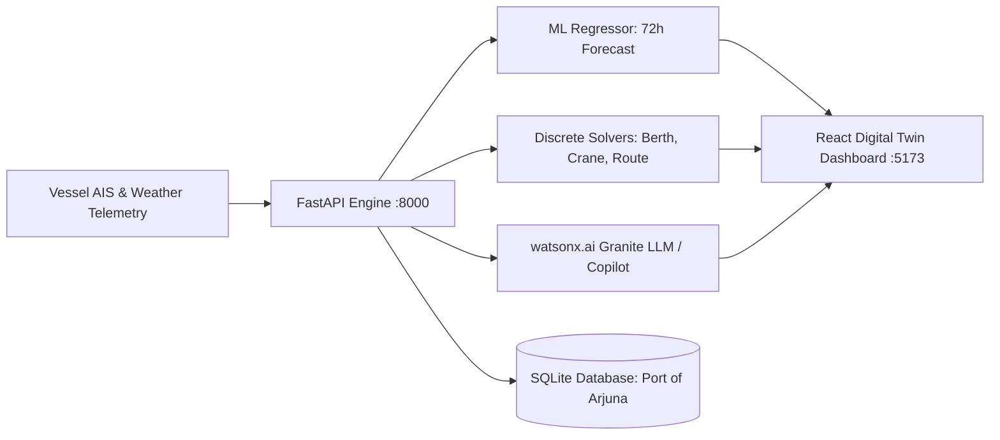

# Solution Overview — PortFlow AI

## What We Built

**PortFlow AI** is an autonomous digital twin and operational optimization platform for container terminals. It replaces manual, reactive spreadsheets with predictive machine learning and deterministic optimization algorithms. Terminal operators can forecast zone congestion up to 72 hours in advance, allocate berths and STS cranes while respecting physical depth and length constraints, navigate deep-draft vessels through dynamic tidal channels, and consult a grounded operations copilot powered by IBM watsonx.ai.

## How It Works

1. **Continuous Telemetry & Hydrographic Ingestion:** Terminal sensors track yard stacking density, quay crane telematics, vessel AIS positions, wind speed, visibility, and semi-diurnal tidal heights.
2. **72-Hour Predictive Machine Learning:** A trained Random Forest regressor evaluates operational metrics in 6-hour intervals across 6 port zones, assigning continuous congestion scores (0–100), risk tiers, and bottleneck drivers.
3. **Priority Berth Optimization:** A greedy priority queue evaluates inbound vessels, enforcing physical safety constraints (draft + 1.0m Under-Keel Clearance, vessel LOA, cargo compatibility) and minimizing dwell times.
4. **Earliest Deadline First (EDF) Crane Scheduling:** 7 Ship-to-Shore (STS) cranes are dynamically assigned to berthed vessels based on departure deadlines and TEU backlogs, maximizing net moves per hour.
5. **Dijkstra Channel Routing:** Navigates vessels across 14 waypoints, automatically calculating minimum under-keel clearance across varying tidal stages.
6. **Grounded AI Operations Copilot:** An operational assistant backed by IBM watsonx.ai (`ibm/granite-3-8b-instruct`) or deterministic grounded engines answers natural-language queries citing specific berth numbers, tide heights, and crane allocations.

## Architecture Flow

## Key Design Decisions

| Decision | Rationale |
|---|---|
| **Random Forest for Zone Congestion** | High explainability with feature importances; captures non-linear interactions between weather gusts, low tides, and crane saturation without overfitting. |
| **Deterministic Priority Queue & EDF Solvers** | Mathematical rigor is critical for maritime safety; berth and crane allocations cannot rely on stochastic LLM generation that may violate physical draft or length limits. |
| **Grounded watsonx.ai Architecture with DEMO_MODE** | Copilot injects live numerical facts from the SQLite state before generating recommendations, guaranteeing zero-hallucination answers while supporting offline evaluation without API key dependencies. |
| **Oceanic Sky Blue Visual Design System** | High-density operational data requires high visual hierarchy, dark/light contrast, and glassmorphism to reduce cognitive fatigue during 12-hour terminal shifts. |

## IBM Technologies Used

- **IBM watsonx.ai (`ibm/granite-3-8b-instruct`):** Used as the core natural language intelligence engine for the Operations Copilot. Granite-3-8B is instructed with live digital twin context to answer complex maritime queries, assess berth conflicts, and recommend crane gang redeployments.
- **IBM Cloud Infrastructure:** Cloud-native architecture ready for deployment on Red Hat OpenShift / IBM Cloud Code Engine with Docker containerization.
